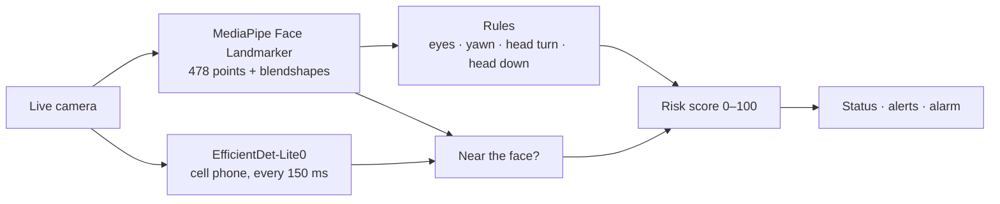

# Driver Monitoring System (Web)

Real-time driver monitoring that runs entirely in the browser. It watches the driver through the live camera on your device and flags drowsiness, yawning, distraction, looking down and phone use, then combines them into a 0–100 risk score with an audible alarm.

**Live demo:** https://amanjaiiinnn.github.io/dms-web/

All processing happens on your device with [MediaPipe](https://ai.google.dev/edge/mediapipe/solutions/guide). The video is never uploaded or recorded.

This is a browser port of a driver monitoring system I first built to run on an STM32MP2 edge board, where the models run on the board's NPU.

## What it detects

| Alert | Rule | Default |
|---|---|---|
| **Drowsy** | Both eyes closed (MediaPipe `eyeBlink` blendshapes) | score > 0.5 for 0.8 s |
| **Yawning** | Mouth height ÷ mouth width | > 0.28 for 0.4 s |
| **Distracted** | Upper lip to left cheek ÷ upper lip to right cheek (head turned) | outside 0.5–2.0 for 0.4 s |
| **Head down** | Nose position between forehead (0) and chin (1) | > 0.58 for 0.5 s |
| **Phone use** | EfficientDet-Lite0 "cell phone" detection whose centre is near the face | confidence ≥ 0.4 |
| **Driver not found** | No face in the frame | – |

If several people are in view, the face closest to the centre of the frame is treated as the driver.

## Risk score

The score starts at 0 and always stays between 0 and 100. Several alerts add up.

| Condition | Change per reference frame |
|---|---|
| Yawning | +7 |
| Drowsy | +5 |
| Head down | +5 |
| Distracted | +2 |
| Phone use | +2 |
| No face | +0.7 |
| Face found, no alerts | −5 |

| Score | Status |
|---|---|
| under 33 | Driver OK |
| 33 to under 66 | Warning |
| 66 and above | Danger (alarm beeps every 2 s) |

The board version applies these points once per frame, at a fixed frame rate. Browsers run anywhere from about 10 to 60 FPS, so here each change is multiplied by the elapsed time × `REF_FPS` (10). The score then moves at the same speed on a slow phone and a fast laptop.

## How it works



1. The Face Landmarker runs on every new camera frame (GPU, with a CPU fallback) and returns 478 face points plus blendshape scores.
2. The rules turn those points into ratios. Each condition must last a short time (the hold time) before it becomes an alert, so a normal blink or a quick glance doesn't trigger one.
3. The phone detector runs at most every 150 ms on the CPU. A phone only counts if its centre falls in the area around the face where a phone held to the ear or in front of the face would be.
4. The risk score is updated from the active alerts, and the page shows the status, the alerts, a log of recent events and an alarm when the score reaches Danger.

## Run it locally

The camera only works on `https://` or `localhost`, so serve the folder instead of opening `index.html` directly:

```bash
python -m http.server 8000
```

Then open http://localhost:8000 and press **Start camera**. The first visit downloads about 20 MB (MediaPipe runtime and two models); after that the browser caches them.

If the device has more than one camera (for example a laptop with a USB webcam), a **Camera** picker appears under the video. The choice is remembered.

## Deploy on GitHub Pages

1. Create a public repository named `dms-web` and push this folder to it.
2. On GitHub, open **Settings → Pages**. Under **Build and deployment**, set **Source** to **Deploy from a branch**, choose `main` and `/ (root)`, and save.
3. After about a minute the site is live at `https://<your-username>.github.io/dms-web/`. Pages serves it over HTTPS, which the camera needs.

There is no build step. Any static host (Netlify, Vercel, Cloudflare Pages) works the same way.

## Tuning

Open the **Tuning** panel on the page. Each row shows the live value next to its threshold, and the live value turns red when it would trigger the alert. Move the slider until the alert fires only when it should. Changes are saved in your browser.

To change the defaults for everyone, edit `DEFAULT_THRESHOLDS`, `HOLD_SECONDS` and the score values in [`js/config.js`](js/config.js).

In testing, a broad smile measured about 0.2 on the yawn ratio. If laughing or talking sets off the yawn alert, raise the yawn threshold to about 0.35.

## Tests

The rules and the score are plain functions with unit tests. They run with Node's built-in test runner (Node 18 or newer, no install needed):

```bash
node --test
```

GitHub Actions runs them on every push.

## Project structure

```
dms-web/
├── index.html          Page layout
├── style.css           Styles, light and dark mode
├── js/
│   ├── main.js         Camera, models, detection loop, drawing, page updates
│   ├── rules.js        Face ratios, face selection, phone-near-face check, hold timer
│   ├── score.js        Risk score and status
│   ├── alarm.js        Alarm beep (Web Audio API)
│   └── config.js       Model URLs, thresholds, hold times, score values
├── tests/
│   └── rules.test.js   Unit tests for rules.js and score.js
├── LICENSE
└── NOTICE              Third-party credits
```

## Differences from the edge version

| | STM32MP2 board | This web version |
|---|---|---|
| Camera | CSI or USB camera on the board | Any camera connected to the visitor's device |
| Face | Face detection, 468-point landmark and iris models on the NPU (`.nb`) | MediaPipe Face Landmarker in the browser (GPU or CPU) |
| Eyes | Eye height ÷ width from the iris model | `eyeBlink` blendshapes |
| Phone / smoking | Custom-trained phone and cigarette detector | Public COCO "cell phone" class. Smoking is not detected. |
| Timing | Points per frame | Points per second (frame-rate independent), plus hold times |

## Limitations

- This is a demo, not a certified safety system.
- With sunglasses the eyes can't be seen, so drowsiness can't be judged.
- Low light reduces landmark accuracy.
- EfficientDet-Lite0 can miss a phone pressed flat against the ear.
- The thresholds were tuned on a small number of faces and may need adjusting.

## Credits and license

Released under the [MIT License](LICENSE).

- The yawning, head-turn and head-down ratios are adapted from NXP's DMS demo (BSD-3-Clause). See [NOTICE](NOTICE).
- [MediaPipe Tasks Vision](https://www.npmjs.com/package/@mediapipe/tasks-vision), the Face Landmarker model and the EfficientDet-Lite0 model are by Google (Apache 2.0). They are loaded from public CDNs at runtime.
